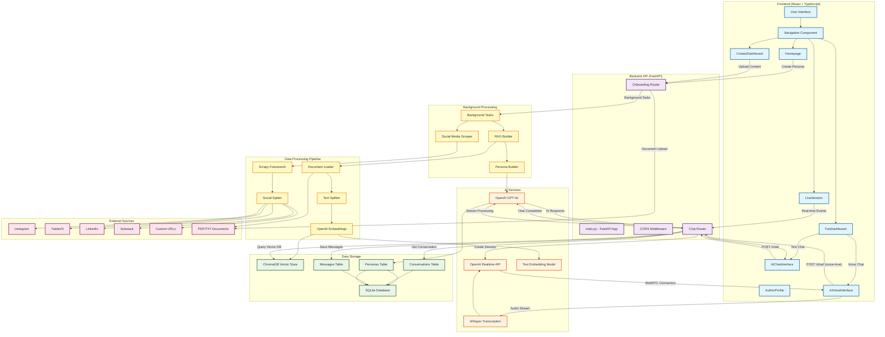

# AI-Powered Fan Engagement Platform - System Architecture Diagram

```mermaid
graph TB
    %% User Interface Layer
    subgraph "Frontend (React + TypeScript)"
        UI[User Interface]
        NAV[Navigation Component]
        HOME[Homepage]
        AUTH[AuthorProfile]
        FAN[FanDashboard]
        CREATOR[CreatorDashboard]
        LIVE[LiveSession]
        CHAT[AIChatInterface]
        VOICE[AIVoiceInterface]
    end

    %% API Gateway Layer
    subgraph "Backend API (FastAPI)"
        MAIN[main.py - FastAPI App]
        CORS[CORS Middleware]
        ONBOARD[Onboarding Router]
        CHATAPI[Chat Router]
    end

    %% Core Business Logic Layer
    subgraph "Background Processing"
        TASKS[Background Tasks]
        SCRAPER[Social Media Scraper]
        RAGBUILD[RAG Builder]
        PERSONA[Persona Builder]
    end

    %% Data Processing Layer
    subgraph "Data Processing Pipeline"
        SCRAPY[Scrapy Framework]
        SOCIAL[Social Spider]
        DOCLOAD[Document Loader]
        TEXTSPLIT[Text Splitter]
        EMBED[OpenAI Embeddings]
    end

    %% AI/ML Layer
    subgraph "AI Services"
        OPENAI[OpenAI GPT-4o]
        REALTIME[OpenAI Realtime API]
        WHISPER[Whisper Transcription]
        EMBEDDING[Text Embedding Model]
    end

    %% Data Storage Layer
    subgraph "Data Storage"
        SQLITE[SQLite Database]
        CHROMA[ChromaDB Vector Store]
        CONV[Conversations Table]
        MSG[Messages Table]
        PER[Personas Table]
    end

    %% External Data Sources
    subgraph "External Sources"
        INSTA[Instagram]
        TWITTER[Twitter/X]
        LINKEDIN[LinkedIn]
        SUBSTACK[Substack]
        CUSTOM[Custom URLs]
        DOCS[PDF/TXT Documents]
    end

    %% User Flows
    UI --> NAV
    NAV --> HOME
    NAV --> FAN
    NAV --> CREATOR
    NAV --> LIVE

    %% Onboarding Flow
    HOME --> |"Create Persona"| ONBOARD
    CREATOR --> |"Upload Content"| ONBOARD
    ONBOARD --> |"Background Tasks"| TASKS
    TASKS --> SCRAPER
    TASKS --> RAGBUILD
    
    %% Data Collection Flow
    SCRAPER --> SCRAPY
    SCRAPY --> SOCIAL
    SOCIAL --> INSTA
    SOCIAL --> TWITTER
    SOCIAL --> LINKEDIN
    SOCIAL --> SUBSTACK
    SOCIAL --> CUSTOM

    %% Document Processing Flow
    ONBOARD --> |"Document Upload"| DOCS
    RAGBUILD --> DOCLOAD
    DOCLOAD --> DOCS
    DOCLOAD --> TEXTSPLIT
    TEXTSPLIT --> EMBED
    EMBED --> EMBEDDING
    EMBED --> CHROMA

    %% Persona Creation Flow
    RAGBUILD --> PERSONA
    PERSONA --> OPENAI
    OPENAI --> PER
    PER --> SQLITE

    %% Chat Flow
    FAN --> |"Text Chat"| CHAT
    CHAT --> |"POST /chat/"| CHATAPI
    CHATAPI --> |"Query Vector DB"| CHROMA
    CHATAPI --> |"Get Conversation"| CONV
    CHATAPI --> |"Chat Completion"| OPENAI
    OPENAI --> |"AI Response"| CHATAPI
    CHATAPI --> |"Save Messages"| MSG
    CHATAPI --> CHAT

    %% Voice Chat Flow
    FAN --> |"Voice Chat"| VOICE
    VOICE --> |"POST /chat/ (voice=true)"| CHATAPI
    CHATAPI --> |"Create Session"| REALTIME
    REALTIME --> |"WebRTC Connection"| VOICE
    VOICE --> |"Audio Stream"| WHISPER
    WHISPER --> REALTIME

    %% Live Session Flow
    LIVE --> |"Real-time Events"| CHATAPI
    CHATAPI --> |"Stream Processing"| OPENAI

    %% Data Persistence
    CONV --> SQLITE
    MSG --> SQLITE
    PER --> SQLITE

    %% Styling
    classDef frontend fill:#e1f5fe,stroke:#01579b,stroke-width:2px
    classDef backend fill:#f3e5f5,stroke:#4a148c,stroke-width:2px
    classDef ai fill:#fff3e0,stroke:#e65100,stroke-width:2px
    classDef storage fill:#e8f5e8,stroke:#1b5e20,stroke-width:2px
    classDef external fill:#fce4ec,stroke:#880e4f,stroke-width:2px
    classDef processing fill:#fff9c4,stroke:#f57f17,stroke-width:2px

    class UI,NAV,HOME,AUTH,FAN,CREATOR,LIVE,CHAT,VOICE frontend
    class MAIN,CORS,ONBOARD,CHATAPI backend
    class OPENAI,REALTIME,WHISPER,EMBEDDING ai
    class SQLITE,CHROMA,CONV,MSG,PER storage
    class INSTA,TWITTER,LINKEDIN,SUBSTACK,CUSTOM,DOCS external
    class TASKS,SCRAPER,RAGBUILD,PERSONA,SCRAPY,SOCIAL,DOCLOAD,TEXTSPLIT,EMBED processing
```

